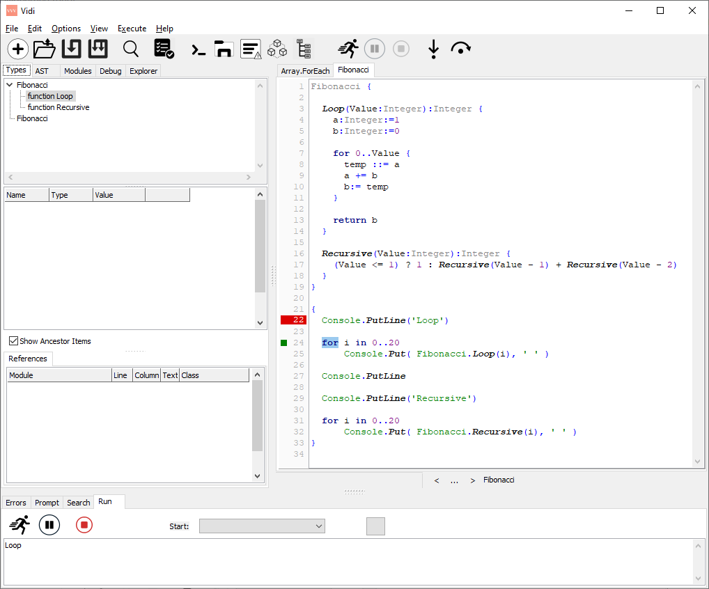

# Vidi
El Llenguatge Vidi

[Baixar el compilador, mini-editor i exemples](https://github.com/davidberneda/Vidi/raw/master/download/Vidi_v0.0.17-alpha.zip)

[Manual de referència del llenguatge](documentation/Vidi_Language_Reference.md)

[Twitter @Vidi_Lang](https://twitter.com/Vidi_Lang)

### En un minut:

* Vidi és un llenguatge de programació, barreja de Java / Javascript, C#, Delphi / Pascal, C++ i altres.
* Tipus de dades estàtiques i estrictes, orientat a objectes, extensible, permet personalitzar la sintaxi.
* Execució interpretada. Sense la necessitat de compilar res per poder arrancar el programa immediatament.
* Molt concís i estricte, fent servir el menor conjunt possible de símbols i paraules reservades.
* Anàlisi estàtic de codi en temps de compilació.
* Editor, depurador i medidor integrats en una petita i simple aplicació.
* Disponible per Windows (32 i 64 bit) i Linux 64 bit.

### En construcció:

* Conversió automàtica (transpiling) a altres llenguatges. Fes servir el teu compilador favorit per generar llibreries (biblioteques) i executables.

### Objectius futurs:

* Re-escriptura del compilador Vidi en llenguatge Vidi. Actualment es basa en FreePascal.
* Suport de plataformes adicionals (Android, Apple)
* Móduls i extensions per aplicacions gràfiques i de interfície d'usuari (Forms / Views / Graphics / etc)

---

